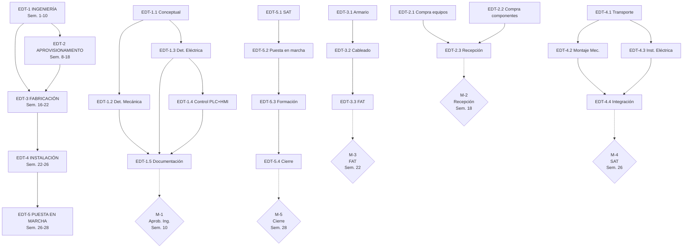

# DOSSIER DE PROYECTO — TEST BENCH EMBRAGUES

**Código:** `O-2024-001-ANON` | **Versión:** v0.3 | **Fecha:** 2026-09-09 | **Estado:** Borrador — Pendiente Validación

---

## SECCIÓN 1 — RESUMEN EJECUTIVO

### 5-Bullet Executive Summary

- **Proyecto:** TEST BENCH EMBRAGUES — Banco de ensayos para componente mecánico de sistema rotativo
- **Cliente:** CLIENTE INDUSTRIAL, S.A. | **Proveedor:** PROVEEDOR TÉCNICO, S.L.
- **Duración:** 1 de septiembre de 2026 — 28 de febrero de 2027 (26 semanas / 6 meses)
- **Presupuesto:** [PENDIENTE — dato no disponible en charter ni oferta]
- **FTE estimado:** [PENDIENTE — calcular tras estimación de horas]
- **Hitos clave:** M-1 Aprobación Ing. Detalle (Sem.10) | M-2 Recepción Equipos (Sem.18) | M-3 FAT (Sem.22) | M-4 SAT (Sem.26) | M-5 Cierre Formal (Sem.28)

### Descripción General

El presente dossier documenta el proyecto de diseño, fabricación, instalación y puesta en marcha de un banco de pruebas de embragues (Test Bench) para la validación de componentes mecánicos de sistemas rotativos. El proyecto será ejecutado por PROVEEDOR TÉCNICO, S.L. para CLIENTE INDUSTRIAL, S.A. según los términos establecidos en la oferta comercial O-2024-001-ANON, versión v0.3.

El alcance incluye la ingeniería completa (conceptual, detalle mecánica, detalle eléctrica y control), el aprovisionamiento de equipos y componentes, la fabricación del armario eléctrico con pruebas FAT, la instalación in situ y la puesta en marcha con validación SAT según normativa aplicable (IEC 60204-1, ISO 13849-1 PLr=d).

**Metodología:** Enfoque híbrido predictivo-agile (Hybrid Level 2), con gestión de cambios formal mediante proceso SC/OC y governance basado en PMBOK 8.ª Edición (PMI, 2025).

---

## SECCIÓN 2 — ALCANCE Y ESPECIFICACIONES TÉCNICAS

### 2.1 Datos Generales del Proyecto

| Campo | Valor |
|-------|-------|
| Código proyecto | O-2024-001-ANON |
| Versión charter | v0.3 |
| Cliente | CLIENTE INDUSTRIAL, S.A. |
| Proveedor | PROVEEDOR TÉCNICO, S.L. |
| Persona de contacto | responsable cliente |
| Email contacto | contacto@cliente-i |
| Fecha inicio | 1 de septiembre de 2026 |
| Fecha cierre estimada | 28 de febrero de 2027 |
| Duración | 26 semanas (6 meses) |
| Validez oferta | 60 días naturales |

### 2.2 Especificaciones Técnicas de Componentes

**[PENDIENTE]** La oferta comercial no incluye tabla explícita de especificaciones técnicas. Los datos de `technical_specs` en el charter JSON están vacíos. Se requiere información del equipo técnico para completar la siguiente tabla:

| # | Nombre Componente | Tipo | Fabricante | Modelo | Cantidad | Tensión | Grado IP | Normativa | Observaciones |
|---|-------------------|------|------------|--------|----------|---------|----------|-----------|---------------|
| 1 | Banco de pruebas de frenos/embragues | [PENDIENTE] | [PENDIENTE] | [PENDIENTE] | 1 | [PENDIENTE] | [PENDIENTE] | ISO 13849-1 PLr=d | [PENDIENTE] |
| 2 | Armario eléctrico potencia y control | [PENDIENTE] | [PENDIENTE] | [PENDIENTE] | 1 | [PENDIENTE] | [PENDIENTE] | IEC 60204-1 | [PENDIENTE] |
| 3 | Variador/es de velocidad | [PENDIENTE] | [PENDIENTE] | [PENDIENTE] | [PENDIENTE] | [PENDIENTE] | [PENDIENTE] | IEC 61800-2 | [PENDIENTE] |
| 4 | PLC + módulo E/S | [PENDIENTE] | [PENDIENTE] | [PENDIENTE] | [PENDIENTE] | 24VDC | IP20 | IEC 60204-1 | [PENDIENTE] |
| 5 | HMI Panel de operación | [PENDIENTE] | [PENDIENTE] | [PENDIENTE] | 1 | 24VDC | [PENDIENTE] | IEC 60204-1 | [PENDIENTE] |
| 6 | Sensores (suministro cliente) | [PENDIENTE] | [PENDIENTE] | [PENDIENTE] | 9 | [PENDIENTE] | [PENDIENTE] | ISO 13849-2 | Ver Anexo B |
| 7 | Sistema cableado y canalizaciones | [PENDIENTE] | [PENDIENTE] | [PENDIENTE] | [PENDIENTE] | [PENDIENTE] | [PENDIENTE] | IEC 60204-1 | [PENDIENTE] |
| 8 | Software supervisión SCADA | [PENDIENTE] | [PENDIENTE] | [PENDIENTE] | [PENDIENTE] | N/A | N/A | [PENDIENTE] | [PENDIENTE] |
| 9 | Documentación técnica | — | — | — | 1 | — | — | IEC 60204-1 | Manuales, planos |

### 2.3 Scope In (Alcance Incluido)

- Ingeniería conceptual y de detalle (mecánica, eléctrica, control PLC+HMI)
- Diseño y fabricación de armario eléctrico de potencia y control
- Aprovisionamiento e instalación de variadores de velocidad, PLC, HMI
- Integración de sensores proporcionados por el cliente (9 uds.)
- Pruebas FAT (Factory Acceptance Test) en taller del proveedor
- Transporte, montaje e instalación en facility del cliente
- Instalación eléctrica y conexionado in situ
- Pruebas SAT (Site Acceptance Test) y puesta en marcha
- Formación al equipo operativo del cliente
- Documentación técnica completa (manuales, planos, protocolos)
- Certificación CE de la máquina completa
- Gestión de proyecto completa (PM, QA, control de cambios)

### 2.4 Scope Out (Alcance Excluido)

- Obra civil (cimentaciones, plataformas, drenaje) — salvo acuerdo explícito en OC
- Sistemas de alimentación eléctrica primaria (trafo, CG, generador) — salvo acuerdo en OC
- Equipos auxiliares no listados en oferta (compresores, chillers, etc.)
- Software de gestión empresarial del cliente (MES, ERP)
- Mantenimiento post-garantía
- Sensores y elementos de instrumentation proporcionados por el cliente fuera del SLA (Anexo B)
- Pruebas de carga o durabilidad más allá del protocolo SAT agreed
- Certificaciones adicionales a CE (UL, CSA, ATEX) — salvo OC

### 2.5 Criterios de Aceptación

#### FAT — Factory Acceptance Test (Semana 22)

| Criterio | Método verificación | Aceptación |
|----------|---------------------|------------|
| Inspección visual armario eléctrico | Checklist visual | Sin defectos, IP correcto |
| Continuity y megger test cableado | Instrumentación | R > 1MΩ, sin cortocircuitos |
| Pruebas funcionales PLC+HMI | Simulación offline | Lógica correcta, sin errores |
| Prueba de variador sin motor | Standalone test | Parametrización correcta |
| Prueba de PARADA DE EMERGENCIA | Test funcional | Parada categoría 0 según ISO 13850 |
| Documentación entregada | Checklist documental | Manuales, planos, protocolos |

**Responsable:** Inspector FAT / Responsable Calidad (PROVEEDOR TÉCNICO, S.L.)
**Aprobación:** Acta FAT firmada por ambos representantes

#### SAT — Site Acceptance Test (Semana 26)

| Criterio | Método verificación | Aceptación |
|----------|---------------------|------------|
| Integración con sistemas cliente | Test de comunicación | Protocolo agreed |
| Funcionalidad completa banco ensayos | Protocolo de pruebas | 100% casos de prueba OK |
| Prueba de seguridad PLr=d | Análisis SIL | Dossier técnico conforme |
| Medida de temperatura, velocidad, aceleración, par | Calibración sensores | Dentro de tolerancia ±[PENDIENTE]% |
| Prueba de duración (si aplica) | Run-in test | Sin fallos en [PENDIENTE] horas |
| Documentación as-built | Revisión documental | Completa y aprobada |

**Responsable:** Jefe de Obra / Técnico SAT (PROVEEDOR) + Representante Cliente
**Aprobación:** Acta SAT firmada por ambos representantes

### 2.6 Normativa Aplicable

| Norma | Título | Aplicación en proyecto |
|-------|--------|------------------------|
| **IEC 60204-1:2018** | Safety of machinery — Electrical equipment of machines | Diseño eléctrico, cableado, protección, marcado |
| **IEC 61800-2:2021** | Adjustable speed electrical power drive systems — General requirements | Variadores de velocidad, requisitos和环境 |
| **ISO 13849-1:2023** | Safety-related parts of control systems — PLr=d | Arquitectura de seguridad, validación PLr=d |
| **ISO 13849-2:2012** | Validation of PLr and performance level | Métodos de validación, diagnóstico |
| **ISO 12100:2010** | Safety of machinery — General principles for design | Principios de gestión del riesgo |
| **IEC 61508:2010** | Functional safety of E/E/PE safety-related systems (SIL 2 si aplica) | Partes de seguridad eléctrico/electrónico |
| **ISO 13850:2015** | Emergency stop function — Principles for design | Función de parada de emergencia |
| **ISO 4413:2010** | Hydraulic fluid power — General rules | Sistemas hidráulicos (si aplica) |
| **ISO 4414:2010** | Pneumatic fluid power — General rules | Sistemas neumáticos (si aplica) |

### 2.7 Estados de Aprobación

| Estado | Descripción | Responsable aprobación | Gate |
|--------|-------------|------------------------|------|
| `engineering_approval` | Aprobación de ingeniería de detalle (planos, specs) | Director Comercial + Cliente | M-1 (Sem.10) |
| `manufacturing_approval` | Liberación a fabricación (nomenclatura, documentación) | Responsable Calidad | M-2 (Sem.18) |
| `fat_approval` | Aceptación FAT (acta firmada) | Inspector FAT + Cliente | M-3 (Sem.22) |
| `site_acceptance` | Aceptación SAT final (acta firmada) | Técnico SAT + Cliente | M-4 (Sem.26) |
| `project_close` | Cierre formal (documentación, lessons learned) | Director Comercial | M-5 (Sem.28) |

---

## SECCIÓN 3 — ESTRUCTURA DE DESGLOSE DEL TRABAJO (EDT)

### 3.1 Vista General EDT — 5 Fases (Nivel 1)

```
EDT-0 GESTIÓN DE PROYECTO (Transversal, Sem. 1-28)
EDT-1 INGENIERÍA (Sem. 1-10)
EDT-2 APROVISIONAMIENTO (Sem. 8-18)
EDT-3 FABRICACIÓN (Sem. 16-22)
EDT-4 INSTALACIÓN (Sem. 22-26)
EDT-5 PUESTA EN MARCHA (Sem. 26-28)
```

### 3.2 Paquetes de Trabajo Detallados (Nivel 3)

#### EDT-1 — INGENIERÍA (Semanas 1-10)

| Código | Nombre paquete | Entregable principal | Responsable | Duración est. | Dependencias |
|--------|---------------|---------------------|-------------|----------------|--------------|
| EDT-1.1 | Ingeniería conceptual | Documento de concepto, Diagrama P&ID, Lista de requisitos | Ing. Eléctrico Senior | 2 semanas | — |
| EDT-1.2 | Ingeniería de detalle mecánica | Planos mecánicos, 3D models, specs materiales | Ing. Mecánico | 4 semanas | EDT-1.1 |
| EDT-1.3 | Ingeniería de detalle eléctrica | Planos unifilares, esquemas, lista cables, specs | Ing. Eléctrico Senior | 4 semanas | EDT-1.1 |
| EDT-1.4 | Ingeniería de control (PLC + HMI) | Programa PLC, screens HMI, specs I/O | Ing. Eléctrico Senior | 4 semanas | EDT-1.3 |
| EDT-1.5 | Documentación y especificaciones |Specs técnicas, manuales draft, protocolos test | Director de Proyecto | 2 semanas | EDT-1.2, EDT-1.3, EDT-1.4 |

#### EDT-2 — APROVISIONAMIENTO (Semanas 8-18)

| Código | Nombre paquete | Entregable principal | Responsable | Duración est. | Dependencias |
|--------|---------------|---------------------|-------------|----------------|--------------|
| EDT-2.1 | Compra equipos principales | Purchase orders firmados, confirmaciones | Resp. Aprovisionamiento | 6 semanas | EDT-1.2, EDT-1.3 |
| EDT-2.2 | Compra componentes eléctricos | Purchase orders, datasheets | Resp. Aprovisionamiento | 4 semanas | EDT-1.3 |
| EDT-2.3 | Recepción y verificación en taller | Goods received note, QC check | Resp. Aprovisionamiento + QC | 1 semana | EDT-2.1, EDT-2.2 |

#### EDT-3 — FABRICACIÓN (Semanas 16-22)

| Código | Nombre paquete | Entregable principal | Responsable | Duración est. | Dependencias |
|--------|---------------|---------------------|-------------|----------------|--------------|
| EDT-3.1 | Fabricación armario eléctrico | Armario montado, etiquetado | Ing. Eléctrico Senior | 4 semanas | EDT-1.3, EDT-2.3 |
| EDT-3.2 | Cableado y conexionado | Cableado completo, continuity test | Ing. Eléctrico Senior | 2 semanas | EDT-3.1 |
| EDT-3.3 | Pruebas FAT en taller | Protocolo FAT, acta firmada | Inspector FAT / QC | 1 semana | EDT-3.2 |

#### EDT-4 — INSTALACIÓN (Semanas 22-26)

| Código | Nombre paquete | Entregable principal | Responsable | Duración est. | Dependencias |
|--------|---------------|---------------------|-------------|----------------|--------------|
| EDT-4.1 | Transporte y recepción en site | Delivery note, packing list | Resp. Aprovisionamiento | 1 semana | EDT-3.3 |
| EDT-4.2 | Montaje mecánico | Equipos mecánicos instalados, alineados | Jefe de Obra | 2 semanas | EDT-4.1 |
| EDT-4.3 | Instalación eléctrica | Cableado in situ, conexiones, tierra | Jefe de Obra | 2 semanas | EDT-4.1, EDT-4.2 |
| EDT-4.4 | Integración con sistemas existentes cliente | Comunicación verificada, interfaces OK | Ing. Eléctrico Senior | 1 semana | EDT-4.2, EDT-4.3 |

#### EDT-5 — PUESTA EN MARCHA (Semanas 26-28)

| Código | Nombre paquete | Entregable principal | Responsable | Duración est. | Dependencias |
|--------|---------------|---------------------|-------------|----------------|--------------|
| EDT-5.1 | Pruebas SAT (Site Acceptance Test) | Protocolo SAT, acta firmada | Técnico SAT | 1 semana | EDT-4.4 |
| EDT-5.2 | Puesta en marcha y optimización | Sistema operativo, params optimizados | Técnico SAT | 1 semana | EDT-5.1 |
| EDT-5.3 | Formación al equipo operativo | Training completed, registros | Técnico SAT | 0.5 semanas | EDT-5.2 |
| EDT-5.4 | Documentación final y cierre | Docs as-built, lessons learned, cierre | Director de Proyecto | 0.5 semanas | EDT-5.3 |

### 3.3 Matriz de Dependencias entre Paquetes EDT

| Paquete | Predecesora(s) obligatoria(s) | Tipo dependencia | Justificación |
|---------|------------------------------|------------------|---------------|
| EDT-1.2 | EDT-1.1 | FS (Finish-Start) | Requiere concepto aprobado |
| EDT-1.3 | EDT-1.1 | FS | Requiere specs conceptuales |
| EDT-1.4 | EDT-1.3 | FS | Requiere lista I/O definida |
| EDT-1.5 | EDT-1.2, EDT-1.3, EDT-1.4 | FS | Consolidación docs |
| EDT-2.1 | EDT-1.2, EDT-1.3 | FS | Necesita specs para PO |
| EDT-2.2 | EDT-1.3 | FS | Necesita lista cables |
| EDT-2.3 | EDT-2.1, EDT-2.2 | FS | Recibe materiales |
| EDT-3.1 | EDT-1.3, EDT-2.3 | FS | Armario + componentes OK |
| EDT-3.2 | EDT-3.1 | FS | Tras armario montado |
| EDT-3.3 | EDT-3.2 | FS | Tras cableado |
| EDT-4.1 | EDT-3.3 | FS | Tras FAT aprobado |
| EDT-4.2 | EDT-4.1 | FS | Tras recepción |
| EDT-4.3 | EDT-4.1, EDT-4.2 | FS | Tras recibir y montar |
| EDT-4.4 | EDT-4.2, EDT-4.3 | FS | Integración completa |
| EDT-5.1 | EDT-4.4 | FS | Sistema listo para SAT |
| EDT-5.2 | EDT-5.1 | FS | Tras SAT |
| EDT-5.3 | EDT-5.2 | FS | Tras puesta en marcha |
| EDT-5.4 | EDT-5.3 | FS | Cierre formal |

### 3.4 Resumen EDT

| Fase EDT | Paquetes (nivel 3) | Duración total | Entregable fase |
|----------|-------------------|----------------|-----------------|
| EDT-1 INGENIERÍA | 5 | 10 semanas | Documentación ingeniería aprobada (M-1) |
| EDT-2 APROVISIONAMIENTO | 3 | 11 semanas (inicio Sem.8) | Equipos recibidos y verificados (M-2) |
| EDT-3 FABRICACIÓN | 3 | 7 semanas (inicio Sem.16) | FAT completado (M-3) |
| EDT-4 INSTALACIÓN | 4 | 5 semanas | SAT completado (M-4) |
| EDT-5 PUESTA EN MARCHA | 4 | 3 semanas | Cierre formal (M-5) |

**Ruta crítica estimada:** EDT-1.1 → EDT-1.3 → EDT-1.4 → EDT-2.1 → EDT-3.1 → EDT-3.3 → EDT-4.1 → EDT-5.1 → EDT-5.4

---

## SECCIÓN 4 — ÁREAS DE ENFOQUE PMBOK 8.ª EDICIÓN

### 4.1 Las 5 Focus Areas — Detalle por Área

#### FOCUS AREA 1: DEVELOPING THE CHARTER
**Definición PMBOK 8.ª (pp. 69-73):** *The process of developing a document that formally authorizes the existence of a project and provides the project manager with the authority to apply organizational resources to project activities.*

**Aplicación al proyecto TEST BENCH EMBRAGUES:**
Este dossier constituye la formalización del Charter. La oferta comercial O-2024-001-ANON v0.3 sirve como base para la autorización formal del proyecto. El Director Comercial de PROVEEDOR TÉCNICO, S.L. autoriza la ejecución y asigna recursos al Director de Proyecto.

**Artefactos generados:**
- Project Charter (Sección 9 de este dossier)
- Business Case documentado
- Stakeholder register preliminar
- Goals and objectives (SMART)
- Constraints and assumptions

**Responsable:** Director Comercial (PROVEEDOR TÉCNICO, S.L.)

---

#### FOCUS AREA 2: DEVELOPING THE MANAGEMENT PLAN
**Definición PMBOK 8.ª (pp. 69-73):** *The process of defining, preparing, and coordinating all plan components and consolidating them into an integrated project management plan.*

**Aplicación al proyecto TEST BENCH EMBRAGUES:**
Se desarrolla un plan de gestión integrado que incluye alcance (EDT), cronograma (Gantt), presupuesto, riesgos (RBS), calidad, comunicación y gestión de cambios. La planificación sigue un enfoque híbrido con horizonte de 4 semanas (rolling wave).

**Artefactos generados:**
- EDT completo (Sección 3)
- Cronograma con hitos (Sección 5)
- Estimación de horas (Sección 6)
- Registro de riesgos RBS (Sección 7)
- Plan de gestión de cambios (Sección 11)
- Matriz RACI (Sección 10)
- Agenda Kick-off meeting (Sección 14)

**Responsable:** Director de Proyecto

---

#### FOCUS AREA 3: DELIVERING THE PROJECT
**Definición PMBOK 8.ª (pp. 69-73):** *The process of producing the overall project deliverables in accordance with the project management plan and the scope baseline.*

**Aplicación al proyecto TEST BENCH EMBRAGUES:**
La entrega se estructura en 5 fases EDT secuenciales con gates de aprobación. Los entregables incluyen: ingeniería de detalle, armario eléctrico, integración, FAT, SAT y documentación completa. Se aplica Delivery Cadence con revisiones al final de cada fase.

**Artefactos generados:**
- Planos eléctricos y mecánicos (EDT-1)
- Equipos aprovisionados y verificados (EDT-2)
- Armario eléctrico manufactured (EDT-3)
- Instalación completada in situ (EDT-4)
- Sistema operativo validado (EDT-5)
- Actas FAT y SAT firmadas
- Documentación as-built

**Responsable:** Director de Proyecto + Ing. Eléctrico Senior + Jefe de Obra

---

#### FOCUS AREA 4: MONITORING AND CONTROLLING PROJECT WORK
**Definición PMBOK 8.ª (pp. 69-73):** *The process of tracking, reviewing, and reporting overall project progress on a regular basis to achieve the performance objectives defined in the project management plan.*

**Aplicación al proyecto TEST BENCH EMBRAGUES:**
Seguimiento quincenal mediante reuniones de status. Control de alcance mediante proceso formal de SC/OC. Monitoreo de riesgos con actualización del RBS.Tracking de hitos vs. schedule baseline. Gestión de issues y action items.

**Artefactos generados:**
- Status reports (quincenales)
- Variance analysis (schedule, cost)
- Change requests log
- Issues register
- Updated risk register
- Forecasts (EVM si aplica)

**Responsable:** Director de Proyecto

---

#### FOCUS AREA 5: CLOSING
**Definición PMBOK 8.ª (pp. 69-73):** *The process of finalizing all project activities to formally complete the project or phase.*

**Aplicación al proyecto TEST BENCH EMBRAGUES:**
El cierre formal (Semana 28) requiere: transferencia de documentación, acta SAT firmada, lessons learned documentadas, cierre de contracts con proveedores, archivar project records, y libera. Finalización de pagos según schedule contractua.

**Artefactos generados:**
- Project closure report
- Lessons learned document
- Product handover acceptance
- Contract close documentation
- Financial close
- Archiving of project records

**Responsable:** Director Comercial + Director de Proyecto

---

### 4.2 Tabla Resumen — Focus Areas

| Focus Area | Aplicación proyecto | Artefactos clave | Responsable |
|------------|---------------------|-------------------|-------------|
| Developing the Charter | Autorización proyecto vía oferta O-2024-001-ANON | Charter, business case, objectives | Director Comercial |
| Developing the Management Plan | Planificación EDT, schedule, riesgos, cambios | Plan PM, EDT, RBS, RACI, Gantt | Director de Proyecto |
| Delivering the Project | Ejecución fases EDT-1 a EDT-5 | Planos, armario, FAT, SAT, docs | Director de Proyecto + equipo |
| Monitoring & Controlling | Seguimiento quincenal, control cambios | Status reports, CR log, forecasts | Director de Proyecto |
| Closing | Cierre formal Sem. 28 | Closure report, lessons learned, archivar | Director Comercial + PM |

---

### 4.3 Interacción de Focus Areas (Fig. 4-13 PMBOK)

Las 5 Focus Areas no son secuenciales sino que se superponen e interactúan continuamente:

```
┌─────────────────────────────────────────────────────────────────┐
│                    FOCUS AREA INTERACTIONS                     │
├─────────────────────────────────────────────────────────────────┤
│                                                                 │
│  DEVELOPING CHARTER ─────────────────────────────────────────► │
│         │                      DELIVERING                       │
│         │         ┌──────────────────────────────────────┐       │
│         │         │                                      │       │
│         ▼         │         DEVELOPING                   │       │
│  DEVELOPING ──────┼────────► MANAGEMENT ────────────────┼──►    │
│  MANAGEMENT ──────┤         PLAN                        │  CLOSING
│  PLAN             │         │                           │       │
│         │         │         │ MONITORING &              │       │
│         │         │         │ CONTROLLING              │       │
│         │         │         │                           │       │
│         │         └─────────┼───────────────────────────┘       │
│         │                   │                                   │
│         └───────────────────┘                                   │
│                                                                 │
│  La iteración continua entre M&C y DELIVERING permite          │
│  ajustes ágiles dentro del marco predictivo dominante.         │
│                                                                 │
└─────────────────────────────────────────────────────────────────┘
```

**Interdependencias clave en TEST BENCH EMBRAGUES:**
1. Charter → Management Plan: Los objetivos del charter definen el alcance y restricciones del plan
2. Charter → Delivering: Autorización de recursos para ejecución
3. Management Plan → Delivering: EDT y schedule guían la ejecución
4. Monitoring & Controlling ↔ Delivering: Feedback loop continuo (quincenal)
5. Monitoring & Controlling → Management Plan: Actualizaciones del baseline si hay OCs aprobados
6. Delivering → Closing: Entregables completados alimentan el cierre
7. Closing → Charter: Lessons learned retroalimentan futuros charters

---

### 4.4 Performance Domains (6 Dominios, pp. 59-70)

| Domain | Intent (Intención) | Key Outputs para TEST BENCH EMBRAGUES |
|--------|-------------------|---------------------------------------|
| **Team** | Crear un ambiente de trabajo que permita al equipo entregar | Equipo multidisciplinario (eléctrico, mecánico, SAT), roles definidos en RACI, plan de formación |
| **Stakeholder** | Alinear expectativas y mantener compromiso | Register de stakeholders, plan de comunicación, gestión activa de CLIENTE INDUSTRIAL, S.A. |
| **Development Approach** | Definir cómo se desarrolla el trabajo | Hybrid Level 2 (predictivo dominante, agile para M&C), fases secuenciales EDT |
| **Planning** | Coordinar actividades y recursos | EDT, Gantt 28 semanas, estimación horas, RBS |
| **Project Work** | Ejecutar el trabajo del proyecto | Entregables técnicos, FAT, SAT, documentación |
| **Delivery** | Entregar los outputs esperados | Sistema Test Bench operativos, certificación CE, formación completada |
| **Measurement** | Evaluar progreso y performance | KPIs: schedule variance, budget adherence, quality metrics, risk score |
| **Uncertainty** | Gestionar ambigüedad y riesgo | RBS, risk owners, contingency plans, SC/OC process |

---

### 4.5 Principles (6 Principios, pp. 35-55)

| Principle | Cómo se manifiesta en TEST BENCH EMBRAGUES |
|-----------|-------------------------------------------|
| **1. Accountability** | Roles RACI definidos, Owner asignado a cada riesgo, CCB con accountable claro |
| **2. Collaboration** | Reuniones quincenales, comunicación abierta cliente-proveedor, equipos cross-funcionales |
| **3. Standardization** | Normativa IEC/ISO aplicada, procesos formalizados (SC/OC), templates estándar |
| **4. Tailoring** | Enfoque híbrido adaptado al proyecto, rolling wave planning, PMO ligero (sin PMO formal) |
| **5. Quality** | FAT y SAT con criterios objetivos, inspección visual, tests funcionales, validación PLr=d |
| **6. Transparency** | Status reports regulares, CR log visible, lecciones aprendidas documentadas, governance boards |

---

### 4.6 Development Approach

**Enfoque adoptado:** Hybrid Level 2 — Predictive Dominant, Agile for Monitoring & Controlling

**Justificación:**
- Alcance fijo definido en oferta comercial (scope estable)
- Fases de ingeniería secuenciales con dependencias lógicas (EDT-1 → EDT-2 → EDT-3)
- Cambios gestionados formalmente vía SC/OC cuando se requiera
- Component Testing y entrega por fases permite agilidad en M&C

**Aplicación:**
- EDT y Gantt fijan baseline de alcance, schedule y coste
- Sprint planning de 2 semanas para actividades de engineering y SAT
- Daily standups NO requeridos (equipo pequeño, comunicación directa)
- Retrospectivas al final de cada fase EDT

---

### 4.7 Integrated Baseline

| Componente | Descripción | Documento referencia |
|------------|-------------|----------------------|
| **Scope Baseline** | EDT completo, WBS dictionary, scope statement | Sección 3 de este dossier |
| **Schedule Baseline** | Gantt 28 semanas, milestones, dependencies | Sección 5 de este dossier |
| **Cost Baseline** | Presupuesto aprobado, breakdown por EDT | [PENDIENTE — dato no disponible] |
| **Performance Measurement Baseline** | Criterios FAT/SAT, KPIs, quality metrics | Secciones 2.5 y 4.4 |
| **Project Management Plan** | Plan integrado de gestión | Este dossier completo |

---

### 4.8 Governance — 4 Capas

```
┌────────────────────────────────────────────────────────────────┐
│                    GOVERNANCE LAYERS                          │
├────────────────────────────────────────────────────────────────┤
│                                                                │
│  ┌──────────────────────────────────────────────────────────┐   │
│  │ LAYER 1: STRATEGIC                                      │   │
│  │ Nivel estratégico — Decisiones de alto impacto          │   │
│  │ Rol: Directorio PROVEEDOR + Alta Dir. CLIENTE           │   │
│  │ Frecuencia: Según necesidad (milestones contractuales) │   │
│  └──────────────────────────────────────────────────────────┘   │
│                           │                                    │
│  ┌──────────────────────────────────────────────────────────┐   │
│  │ LAYER 2: CONTROL                                         │   │
│  │ Nivel de control — Oversight de proyecto                 │   │
│  │ Rol: Director Comercial (PROVEEDOR)                       │   │
│  │ Función: Approval OCs Major/Emergency, budget control     │   │
│  │ Frecuencia: Quincenal (status review)                     │   │
│  └──────────────────────────────────────────────────────────┘   │
│                           │                                    │
│  ┌──────────────────────────────────────────────────────────┐   │
│  │ LAYER 3: PROJECT                                         │   │
│  │ Nivel de proyecto — Gestión día a día                     │   │
│  │ Rol: Director de Proyecto (PROVEEDOR)                     │   │
│  │ Función: Execution, M&C, reporting                        │   │
│  │ Frecuencia: Continuo                                      │   │
│  └──────────────────────────────────────────────────────────┘   │
│                           │                                    │
│  ┌──────────────────────────────────────────────────────────┐   │
│  │ LAYER 4: WORK                                            │   │
│  │ Nivel de trabajo — Ejecución técnica                     │   │
│  │ Rol: Ing. Eléctrico, Ing. Mecánico, Jefe de Obra        │   │
│  │ Función: Entregables técnicos, FAT, SAT                   │   │
│  └──────────────────────────────────────────────────────────┘   │
│                                                                │
└────────────────────────────────────────────────────────────────┘
```

**RACI de Gobernanza:**

| Actividad | Directorio PROVEEDOR | Director Comercial | Director de Proyecto | Rep. Cliente |
|-----------|:--------------------:|:------------------:|:-------------------:|:------------:|
| Aprobación Charter | I | A | R | C |
| Aprobación OC Minor/Moderate | — | A | R | I |
| Aprobación OC Major/Emergency | I | A | R | A |
| Aprobación FAT | I | A | R | C |
| Aprobación SAT | I | A | R | A |
| Cierre proyecto | A | R | R | C |

*R = Responsible, A = Accountable, C = Consulted, I = Informed*

**Nota:** No existe PMO formal. El rol de PM lo asume el Director Comercial de facto con apoyo del Director de Proyecto designado.

**CCB (Change Control Board):**
- Minor/Moderate changes: Director Comercial (interno PROVEEDOR)
- Major/Emergency changes: Director Comercial + Representante Cliente

---

### 4.9 Delivery Cadence

| Entrega | Fase EDT | Timing | Gate de aprobación |
|---------|----------|--------|-------------------|
| Documentación Ing. Aprobada | EDT-1 | Sem. 10 (M-1) | Approval cliente |
| Equipos recibidos taller | EDT-2 | Sem. 18 (M-2) | Goods received note |
| FAT Completado | EDT-3 | Sem. 22 (M-3) | Acta FAT firmada |
| SAT Completado | EDT-4/5 | Sem. 26 (M-4) | Acta SAT firmada |
| Cierre formal | EDT-5 | Sem. 28 (M-5) | Documentación completa |

**Revisiones al final de cada fase:**
- Phase gate reviews con cliente
- Decision points para continuar o corrective actions
- Actualización de baseline si hay OCs aprobados

---

### 4.10 Tailoring (6 Decisiones)

| # | Decisión Tailoring | Selección | Justificación |
|---|-------------------|-----------|---------------|
| 1 | **Development approach** | Hybrid Level 2 | Alcance fijo, fases secuenciales, cambios via SC/OC |
| 2 | **Life cycle** | Predictive con fases iterativas | EDT predecible, sprint ágiles en M&C |
| 3 | **Scheduling** | Semanas 1-28, duración fija | Proyecto de 6 meses, milestones contractuales |
| 4 | **Planning horizon** | 4 semanas (rolling wave) | Flexibilidad para replanning sin perder baseline |
| 5 | **Estimating technique** | Análogo para ingeniería, paramétrico para fabricación | Experiencia previa, breakdown de componentes |
| 6 | **Reviews** | FAT + SAT formales | Requerimientos contractuales, normativa CE |

---

## SECCIÓN 5 — CRONOGRAMA Y HITOS (GANTT)

### 5.1 Diagrama de Dependencias EDT (Mermaid Flow)



### 5.2 Gantt ASCII — 28 Semanas

Leyenda: `##` EDT-1 | `==` EDT-2 | `%%` EDT-3 | `++` EDT-4 | `**` EDT-5 | `--` Hitos/Milestones | `  ` Fin de semana/feriado

```
Semana:           1    2    3    4    5    6    7    8    9   10   11   12   13   14   15   16   17   18   19   20   21   22   23   24   25   26   27   28
                  |----|----|----|----|----|----|----|----|----|----|----|----|----|----|----|----|----|----|----|----|----|----|----|----|----|----|----|
EDT-1.1 Concpetual##   ##                                                                                                                             
EDT-1.2 Mecánica  [PENDIENTE: timing específico]                                                                                                       
EDT-1.3 Eléctrica     ##   ##   ##   ##                                                                                                               
EDT-1.4 Control                               ##   ##   ##   ##                                                                                      
EDT-1.5 Document.                                     ##   ##                                                                                         
                           M-1--                                                                                                                       
EDT-2.1 Compra eq.                  ==   ==   ==   ==   ==   ==   ==                                                                                  
EDT-2.2 Compra comp.                          ==   ==   ==   ==                                                                                      
EDT-2.3 Recepción                                                  ==                                                                                 
                                                        M-2--                                                                                          
EDT-3.1 Armario                                                        %%   %%   %%   %%                                                        
EDT-3.2 Cableado                                                              %%   %%                                                      
EDT-3.3 FAT                                                                   %%                                                        
                                                                                   M-3--                                                                  
EDT-4.1 Transporte                                                                     ++                                                        
EDT-4.2 Montaje Mec.                                                                     ++   ++                                                      
EDT-4.3 Inst. Eléctrica                                                                   ++   ++                                                    
EDT-4.4 Integración                                                                           ++                                            
                                                                                              M-4--                                                
EDT-5.1 SAT                                                                                       **                                          
EDT-5.2 Puesta marca                                                                                   **                              
EDT-5.3 Formación                                                                                              **                        
EDT-5.4 Cierre                                                                                                   **                        
                                                                                                                   M-5--
```

**[NOTA]** El Gantt above es una representación esquemática. Se requiere herramienta de scheduling (MS Project, Primavera, etc.) para cronograma detallado con dependencias y resource leveling.

### 5.3 Tabla de Hitos (Milestones)

| # | Hito | Fecha | Semana | Tipo | Condición de paso (Gate) | Entregable requerido |
|---|------|-------|--------|------|--------------------------|---------------------|
| **M-1** | Aprobación Ingeniería de Detalle | ~15 nov 2026 | 10 | Contractual | Planos y specs aprobadas por cliente | Planos eléctricos, mecánicos, P&ID firmados |
| **M-2** | Recepción Equipos en Taller | ~10 ene 2027 | 18 | Internal | Goods received note firmados | Guía de recepción, QC checks OK |
| **M-3** | FAT Completado | ~7 feb 2027 | 22 | Contractual | Protocolo FAT firmado por ambos | Acta FAT + Protocolo de pruebas |
| **M-4** | SAT Completado | ~7 mar 2027 | 26 | Contractual | Acta SAT firmada por ambos | Acta SAT + Protocolo de pruebas |
| **M-5** | Cierre Formal | ~28 feb 2027 | 28 | External | Documentación completa + forms | Docs as-built, lessons learned, contract close |

**Tipos de hito:**
- **Contractual:** Requerido contractualmente, bloquea hito de pago
- **Internal:** Control interno de PROVEEDOR TÉCNICO, S.L.
- **External:** Involucra participación formal del cliente

### 5.4 Calendario de Feriados (España, 2026-2027)

| Fecha | Festivo |
|-------|---------|
| 12 oct 2026 | Fiesta Nacional de España |
| 1 nov 2026 | Todos los Santos |
| 6 dic 2026 | Constitución Española |
| 8 dic 2026 | Inmaculada Concepción |
| 25 dic 2026 | Natividad del Señor |
| 1 ene 2027 | Año Nuevo |
| 6 ene 2027 | Epifanía del Señor |
| 14 abr 2027 | Jueves Santo |
| 15 abr 2027 | Viernes Santo |
| 1 may 2027 | Fiesta del Trabajo |

---

## SECCIÓN 6 — ESTIMACIÓN DE HORAS

### 6.1 Estimación por EDT

**[PENDIENTE]** Los datos de estimación de horas no están disponibles en el charter ni en la oferta comercial. La siguiente tabla refleja valores **estimados** basados en experiencia análoga para proyectos de similar envergadura (banco de ensayos + armario eléctrico + integración). Se requiere validación por parte del equipo técnico.

| Código EDT | Descripción | Horas Ingeniería | Horas Fabricación | Horas Instalación | Total paquete |
|------------|-------------|:----------------:|:-----------------:|:-----------------:|:-------------:|
| EDT-1.1 | Ingeniería conceptual | 80 | — | — | **80** |
| EDT-1.2 | Ingeniería detalle mecánica | 160 | — | — | **160** |
| EDT-1.3 | Ingeniería detalle eléctrica | 200 | — | — | **200** |
| EDT-1.4 | Ingeniería control (PLC+HMI) | 240 | — | — | **240** |
| EDT-1.5 | Documentación y especificaciones | 60 | — | — | **60** |
| **EDT-1 SUBTOTAL** | | **740** | — | — | **740** |
| EDT-2.1 | Compra equipos principales | 40 | — | — | **40** |
| EDT-2.2 | Compra componentes eléctricos | 20 | — | — | **20** |
| EDT-2.3 | Recepción y verificación | 16 | 8 | — | **24** |
| **EDT-2 SUBTOTAL** | | **76** | **8** | — | **84** |
| EDT-3.1 | Fabricación armario eléctrico | — | 320 | — | **320** |
| EDT-3.2 | Cableado y conexionado | — | 120 | — | **120** |
| EDT-3.3 | Pruebas FAT en taller | 40 | 40 | — | **80** |
| **EDT-3 SUBTOTAL** | | **40** | **480** | — | **520** |
| EDT-4.1 | Transporte y recepción site | — | — | 24 | **24** |
| EDT-4.2 | Montaje mecánico | — | — | 160 | **160** |
| EDT-4.3 | Instalación eléctrica | — | — | 120 | **120** |
| EDT-4.4 | Integración sistemas cliente | 40 | — | 40 | **80** |
| **EDT-4 SUBTOTAL** | | **40** | — | **344** | **384** |
| EDT-5.1 | Pruebas SAT | 40 | — | 80 | **120** |
| EDT-5.2 | Puesta en marcha y optimización | 24 | — | 56 | **80** |
| EDT-5.3 | Formación al equipo operativo | 16 | — | 24 | **40** |
| EDT-5.4 | Documentación final y cierre | 40 | — | — | **40** |
| **EDT-5 SUBTOTAL** | | **120** | — | **160** | **280** |
| | | | | | |
| **TOTAL GENERAL** | | **1,016** | **488** | **504** | **2,008 horas** |

### 6.2 Ratio de Carga de Trabajo

| Métrica | Valor | Notas |
|---------|-------|-------|
| Total horas proyecto | 2,008 h | Estimación basada en analogía |
| Duración proyecto | 26 semanas | 1 sep 2026 — 28 feb 2027 |
| Semanas por mes (media) | 4.33 | 26 semanas / 6 meses |
| Ratio medio | 77.2 h/mes | Carga media mensual |
| Ratio medio | 9.65 h/semana | Base 5 días/semana |
| FTE (Full-Time Equivalent) | 2.6 FTE | Asumiendo 40h/semana por FTE |

**FTE necesarios:** 2,008h ÷ 26sem ÷ 40h/FTE/sem ≈ **1.93 FTE** como mínimo
**Recomendación:** Asignar **3 FTE** para absorber imprevistos y holguras

### 6.3 Distribución por Perfil Profesional

| # | Perfil profesional | Horas estimadas | % sobre total | Fase principal |
|---|-------------------|:---------------:|:-------------:|-----------------|
| 1 | Ingeniero Eléctrico Senior | 720 | **35%** | EDT-1, EDT-3 |
| 2 | Ingeniero Mecánico | 280 | **14%** | EDT-1, EDT-4 |
| 3 | Programador PLC + SCADA | 320 | **16%** | EDT-1, EDT-5 |
| 4 | Jefe de Obra / Técnico SAT | 400 | **20%** | EDT-4, EDT-5 |
| 5 | Responsable de Proyecto | 200 | **10%** | Todas (gestión) |
| 6 | Responsable Calidad / Inspector FAT | 88 | **5%** | EDT-3, EDT-5 |

### 6.4 Distribución Gráfica ASCII por Perfil

```
PERFIL                          DISTRIBUCIÓN HORAS
═══════════════════════════════════════════════════════════════════════
Ingeniero Eléctrico Senior      |███████████████████████| 720h (35%) ████
Programador PLC+SCADA           |██████████████         | 320h (16%) ██
Jefe de Obra / SAT              |████████████████████   | 400h (20%) ███
Ingeniero Mecánico              |████████████           | 280h (14%) ██
Responsable de Proyecto         |█████████              | 200h (10%) █
Responsable Calidad             |████                    |  88h ( 5%) ▏
═══════════════════════════════════════════════════════════════════════
                                    TOTAL: 2,008 horas
```

### 6.5 Distribución Temporal por Bloques de 4 Semanas

| Periodo | Semanas | Horas estimadas | EDT activo | Notas |
|---------|---------|:---------------:|------------|-------|
| Bloque 1 | 1-4 | 320 h | EDT-1 | peak ingeniería conceptual |
| Bloque 2 | 5-8 | 360 h | EDT-1, EDT-2 (inicio) | ingeniería detalle + compras |
| Bloque 3 | 9-12 | 400 h | EDT-1, EDT-2 | M-1 en Sem.10 |
| Bloque 4 | 13-16 | 360 h | EDT-2, EDT-3 | M-2 en Sem.18, inicio fabricación |
| Bloque 5 | 17-20 | 320 h | EDT-3 | fabricación armario, cableado |
| Bloque 6 | 21-24 | 160 h | EDT-3, EDT-4 | FAT + transporte instalación |
| Bloque 7 | 25-28 | 88 h | EDT-4, EDT-5 | SAT, puesta en marcha, cierre |

### 6.6 Bar Chart ASCII — Distribución por EDT

```
EDT-1 INGENIERÍA        |████████████████████████████████████| 740h (37%)
EDT-2 APROVISIONAMIENTO  |███████                           |  84h  (4%)
EDT-3 FABRICACIÓN        |█████████████████████████████      | 520h (26%)
EDT-4 INSTALACIÓN        |██████████████████████             | 384h (19%)
EDT-5 PUESTA EN MARCHA   |██████████████████                 | 280h (14%)
                         |============================================|
                         0h        500h        1000h       1500h      2000h
```

---

## SECCIÓN 7 — REGISTRO DE RIESGOS (RBS)

### 7.1 Matriz de Probabilidad × Impacto (P × I)

| | **Impacto Bajo (1)** | **Impacto Medio (2)** | **Impacto Alto (3)** |
|---|:---:|:---:|:---:|
| **Probabilidad Alta** | 3 | 6 | 9 |
| **Probabilidad Media** | 2 | 4 | 6 |
| **Probabilidad Baja** | 1 | 2 | 3 |

**Escala de Scoring:**
- 🟢 **Score 1-2:** Bajo — Aceptar y monitorear
- 🟡 **Score 3-4:** Medio — Plan de mitigación requerido
- 🟠 **Score 6:** Alto — Plan de mitigación + contingencia
- 🔴 **Score ≥ 9:** Crítico — Escalación a CCB, acción inmediata

### 7.2 Registro de Riesgos Detallado

#### Categoría 1: RIESGOS TÉCNICOS

| ID | Nombre riesgo | Causa raíz | P | I | P×I | Score | Mitigación | Contingencia |
|----|--------------|------------|:-:|:-:|:---:|:-----:|------------|--------------|
| R-1.1 | Retraso en specs de sensores por cliente | Cliente no proporciona specs a tiempo | M | A | 2×3 | **6** 🟠 | Confirmar SLA sensores en Kick-off, seguimiento semanal | Reprogramar EDT-4.2, OC si impacta hitos contractuales |
| R-1.2 | Incompatibilidad variador-motor | Selección técnica incorrecta | B | A | 1×3 | **3** 🟡 | Revisión técnica por Ing. Senior, datasheets firmados | Sustitución variador, OC si cambio de